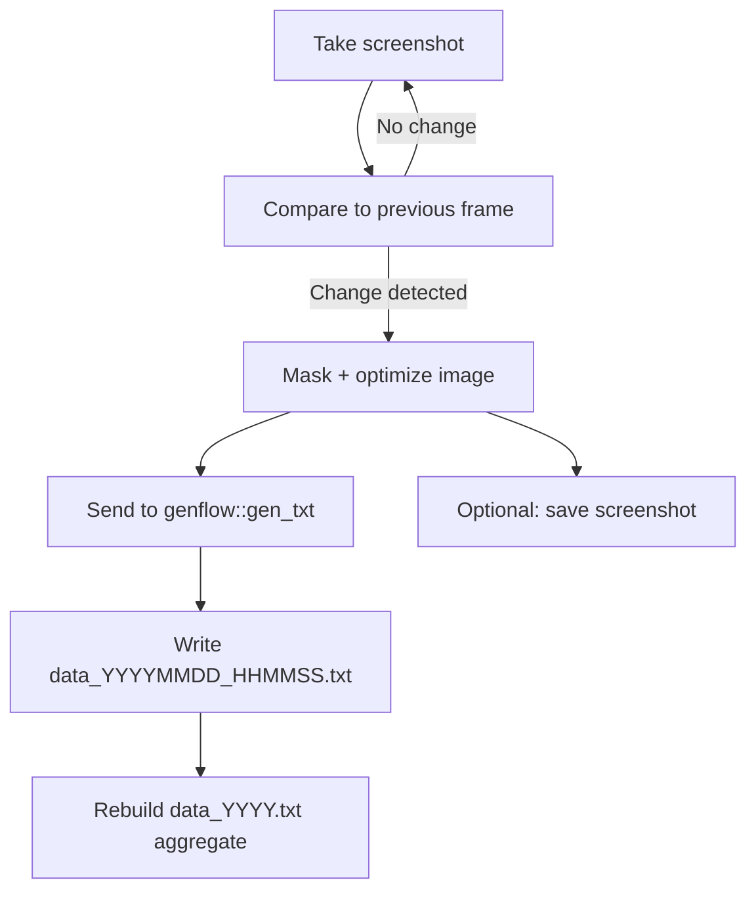

# overseer 👀🖼️

Watch your screen, capture meaningful changes, and turn them into structured notes with an LLM.  
Think of it as a tiny, always-on observer that writes a timeline of what was happening.

## What it does ✨

- Detects meaningful screen changes (not every frame)  
- Sends the changed screenshot to `genflow::gen_txt()`  
- Saves model notes per message **and** maintains a yearly aggregate  
- Optional: save processed screenshots by year/month  
- Debug mode to see exactly what the watcher is "seeing"  

## Quick start 🚀

```r
library(overseer)

instructions <- "Describe what the user was doing in the screenshot."
overseer(
  instructions = instructions,
  max_interval = 10,
  change_threshold = 0.02,
  service = "openai",
  model = "gpt-4o-mini"
)
```

## Requirements ✅

- `scrot` available in PATH (the function will try to install it on Linux)
- R packages: `magick`, `genflow`
- Install genflow: `remotes::install_github("hugorteixeira/genflow")`

## Install 🧪

```r
install.packages("magick")
install.packages("remotes")
remotes::install_github("hugorteixeira/genflow")
```

## How it works 🧠



## Where files go 📂

By default, everything lives in `~/.overseer`:

```
~/.overseer/
  data/
    YYYY/
      data_YYYY.txt
      data_YYYYMMDD_HHMMSS.txt
    YYYY/MM/
      screenshot_YYYYMMDD_HHMMSS.png
  debug/
    debug_current_YYYYMMDD_HHMMSS.png
  tmp/
    prev.png
    current.png
```

Notes:
- `data_YYYY.txt` is rebuilt every time, oldest at the top, newest at the bottom.
- Screenshots are stored only if `save_screenshots = TRUE`.

## Fun possibilities 💡

- 📓 Auto-generate a daily activity journal  
- 🔍 Track when you shift tasks or focus contexts  
- 🧪 Create a dataset of "what I was doing" for self‑analysis  
- 🧭 Build a personal productivity map over time  
- 🎬 Turn the log into a narrated timeline or summary  

## Tips & tuning 🎛️

- Lower `change_threshold` to catch subtle changes (0.002–0.01).
- Use `debug = TRUE` to see change fractions and save debug frames.
- If nothing triggers, it usually means the change threshold is too high.

Have fun exploring your own "screen timeline" 👀

---

<p align="center">Built with love and energy drinks for the R community 💙⚡</p>
